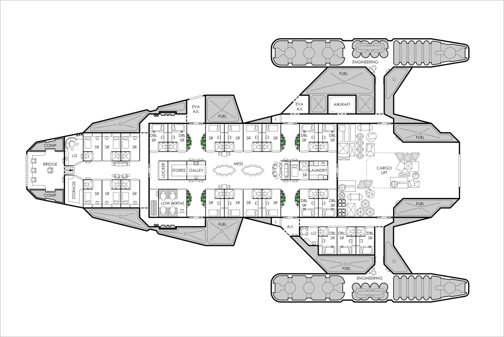

> [!infobox]
> # Wraith
> ![[]]
> ## CREW    
> Pilot, Astrogator, Engineer, Gunner  
> 
> ## HULL: 40
> &nbsp;
> ##  POWER  
> Basic Ship Systems  
> 20  
> ———————————  
> Manoeuvre Drive  
> 50  
> ———————————  
> Jump Drive  
> 30  
> ———————————  
> Sensors  
> 2  
> ———————————  
> Weapons  
> 5
> ———————————  
> Fuel Processors  
> 2
>
> ## Costs
> 
> Purchase Cost: MCr60.7233
> 
> Maintenance Cost: Cr5,060/month

| TL 12           |                                                                           | Tons                   | Cost (MCr)               |
| --------------- | ------------------------------------------------------------------------- | ---------------------- | ------------------------ |
| Hull            | 100 tons, Streamlined   Stealth (Improved)                             | —   —               | 6   10                |
| Armour          | Crystaliron, Armour: 4                                                    | 6                      | 1.2                      |
| M-Drive         | Thrust 5                                                                  | 5                      | 10                       |
| J-Drive         | Jump 3                                                                    | 12.5                   | 18.75                    |
| Power           | Fusion (TL 12), Power 110                                                 | 7.3333                 | 7.3333                   |
| Fuel            | 12 Weeks of Operation   Fuel Scoops   Fuel Processors (40 tons/day) | 3   —   2        | —   —   0.1        |
| Bridge          | Bridge                                                                    | 10                     | 0.5                      |
| Computer        | Computer/10/bis                                                           | —                      | 0.24                     |
| Software        | Intellect   Jump Control/3   Library   Manoeuvre                 | —   —   —   — | —   0.3   —   — |
| Sensors         | Military Grade                                                            | 2                      | 4.1                      |
| Weapons         | Double Turret (Beam Laser)                                                | 1                      | 1                        |
| Accommodation   | Standard x2                                                               | 8                      | 1                        |
| Common Areas    | Common Areas                                                              | 2                      | 0.2                      |
| Cargo           | Cargo Space                                                               | 41.1667                | —                        |
| **Total Cost:** |                                                                           |                        | **MCr60.7233**           |
## Overview
The Wraith-Class Small Ship is a sleek, stealth-optimized vessel designed for covert operations and rapid response missions. Its streamlined hull and advanced stealth systems make it difficult to detect, while crystaliron armor provides solid protection without sacrificing speed. The Wraith is equipped with powerful drives for impressive maneuverability and jump capability, and its military-grade sensors and double beam laser turret ensure it’s ready for both reconnaissance and combat. With comfortable accommodations for a small crew and ample cargo space, the Wraith is a versatile choice for those who value agility, discretion, and reliability in deep space.

---

# Dragonstar

